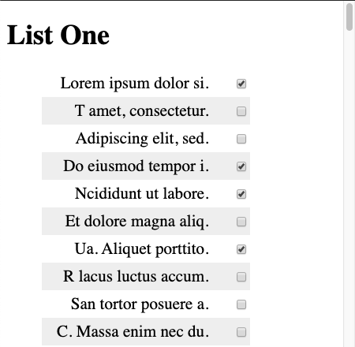
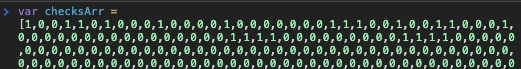

# Using JavaScript to speed up a repetitive task.

This is a quick walk through of how I sped up a task using JavaScript.
The example in this tutorial is based on a situation I came across at work.

Imagine you had two identical lists of labels with checkboxes. For the task you have to check and make sure that the second list has the all of inputs checked in that the first one has.

This may be a very simple and specific example, but it makes it a good place to start.

  

I was a third of the way through manually checking in boxes on the second list when I realized their was a smarter way of doing this.

My idea was to write a script to traverse the dom and store information about my first list, and then applying that data to the second list. 

I did all of my work in the console.

### On List One

I began by selecting all of the checkbox inputs and storing them in the variable **allBoxes**:

    var allBoxes = Array.from( document.querySelectorAll('input[type="checkbox"]') );

I'd like to use array methods on this so I used `Array.from()` to turn the selection into an array.

`querySelectorAll()` will return a nodelist, which is an array-like list of html DOM elements. A nice thing about this method is that any valid CSS selector can be used, even pseudo-classes.

On the original lists I was working with, there were hidden checkbox's with the class of 'fake-checkbox' on them. Also the inputs were nested in tables. I had to use a selector like this to get what I needed: 
`document.querySelectorAll('td.checkbox input:not(.fake-checkbox)');`

Now I have a list of the checkboxes, all I need for this task is to know whether or not they are checked in or not.
In some scenarios I may want to keep the label name or some other identifying information, but because this is a simple example with both lists having the same inputs all we need to know is the checked value in the order that they appear.

Looking at any individual selected element you can see that there is a 'checked' property with either the value `true` or `false`.
`console.dir(allBoxes[0])`

I used the .map array method to loop through the list. .map will take a callback function that runs on each element in the array. 
 I'll check `if (box.checked == true)`. Then return a value, 1 for checked, 0 for unchecked.

    // Returns an array, 0 for unchecked, 1 for checked.
    var checksArr = allBoxes.map(function(box){
        if(box.checked == true){
            return 1;
        }else{
            return 0;
        }
    });

This stores a series of 1's and 0's into the checksArr, directly corresponding to the list of checkboxes in our list.

So far everything we have done has been on the first list, now we need a way to use this data on the second list. Without learning how to do some kind of local storage saving and loading (which I plan on learning next), I used this to copy the array:

    // copy to clipboard.
    copy(JSON.stringify(checksArr));

Now the array of 1's and 0's is stored in my clipboard.

### On List Two

I can now paste this into a variable in the console on the page with my second list.

And now repeating what we did on the first list, we need to store all of the inputs in a variable.

    var allBoxes = Array.from( document.querySelectorAll('input[type="checkbox"]') );

All we need to do is loop through the list, looking to see if the value is checked, while also looking at the checkArr array value for that index's value. 
If the input is unchecked, but our checksArr says it should be checked then we check it in.

    for(let i = 0; i < checksArr.length; i++) {
        if(allBoxes[i].checked == false && checksArr[i] == 1){
            allBoxes[i].checked = true;
        }
    }

For this particular example the algorithm could have been sped up by just going to the index's that had 1's and checking them in, but this only loops through the list once so it is still efficient.
