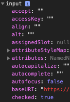

# Using JavaScript to Copy Form Inputs

Imagine you had two identical lists of checkboxes on two seperate web pages. 
For this task you have to make sure that the second list has all of the same inputs checked-in as the first list.

https://codepen.io/Bearded1/pen/abbVypQ  https://codepen.io/Bearded1/pen/yLLPobp

Breaking down the problem into smaller tasks:

1.  Traverse the DOM of the **first** list and store information about the inputs. 
2.  Bring that data over to the webpage with the second list.
3.  Traverse the DOM of the **second** list and store information about the inputs.
4.  Compare the data from the first list with the second, and make the needed changes to the DOM.

I did all of my work in the console.

### 1. 

On List One
I began by selecting all of the checkbox inputs and storing them in a variable called **allCheckboxes**:

    var allBoxes = Array.from( document.querySelectorAll('input[type="checkbox"]') );

I'd like to use array methods on this so I used `Array.from()` to turn the selection into an array.

`querySelectorAll()` will return a nodelist, which is an array-like list of html DOM elements. A nice thing about this method is that any valid CSS selector can be used, even pseudo-classes.

Now I have a list of the checkboxes, all we need to know is the checked value and the order in which they appear.

Looking at any individual selected element you can see that there is a 'checked' property with either the value `true` or `false`.
`console.dir(allBoxes[0])`

I used the .map array method to loop through the list. .map will take a callback function that runs on each element in the array. 
Returning 'true' for checked in boxes or 'false' otherwise.

    // Returns an array, 0 for unchecked, 1 for checked.
    var checksArray = allBoxes.map(function(box){
        return box.checked;
    });

### 2.

So far everything we have done has been on the first list, now we need a way to use this data on the second list. I used this to copy the array to my clipboard:

    // copy to clipboard in Chrome or Firefox
    copy(JSON.stringify(checksArray));

Now the array values is stored in my clipboard.

-------------------------------------------------------------------------------------------------------
#### On List Two

I can now paste this into a variable in the console on the page with my second list.

    var checksArray = [false, false, true, false, ...]

### 3.

And now repeating what we did on the first list, we need to store all of the inputs in a variable.

    var allBoxes = Array.from( document.querySelectorAll('input[type="checkbox"]') );

### 4.

All we need to do is loop through the list, looking to see if the value is checked, while also looking at the checkArray values for that index. 
If the input is unchecked, but our checksArray says it should be checked then we check it in.

    for(let i = 0; i < checksArray.length; i++) {
        if(allBoxes[i].checked === false && checksArray[i] === true){
            allBoxes[i].checked = true;
        }
    }

## Taking it further.
What are some ways this could done more efficiently or extended for more use cases?
Could the algorithm for checking boxes be made more efficient?
Could you store the values at the same time as mapping all the input values?

     

